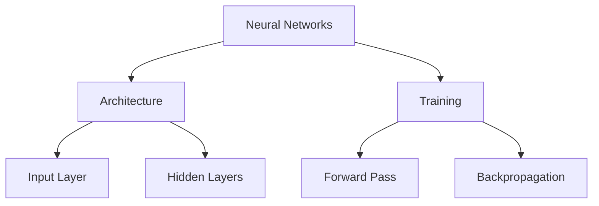
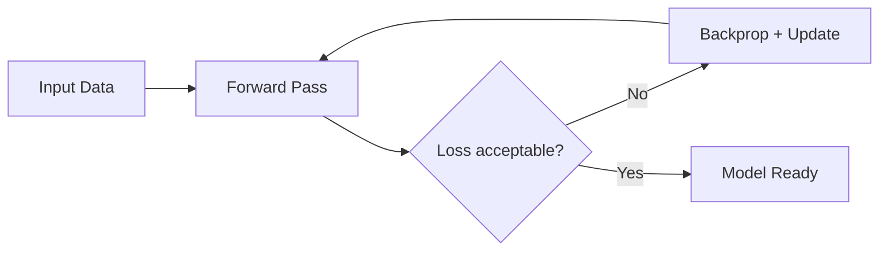
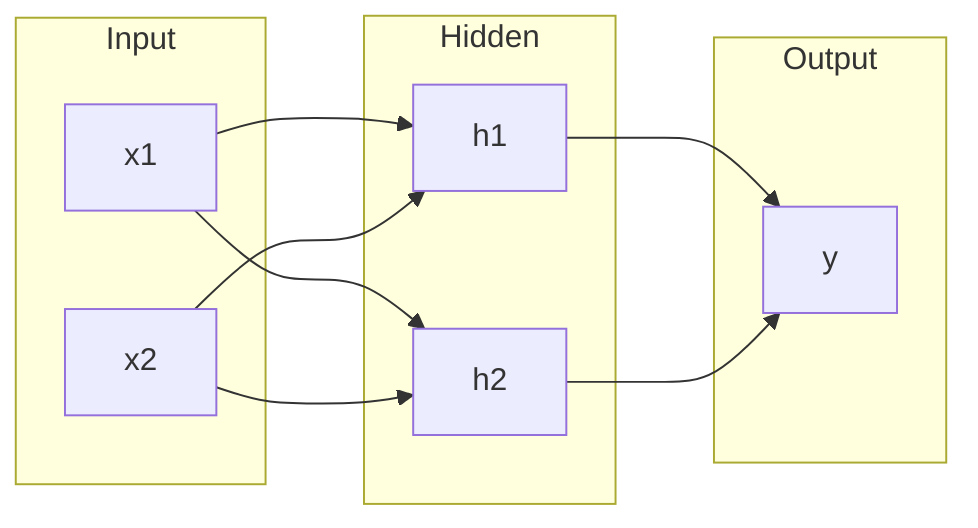
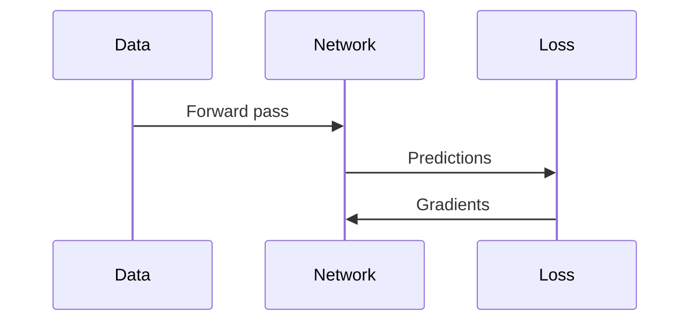
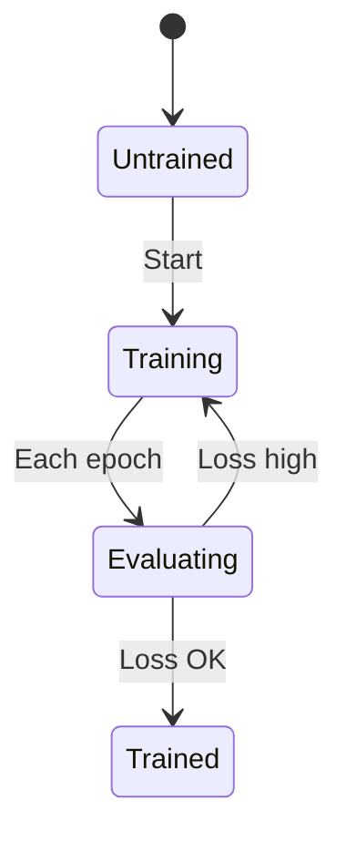
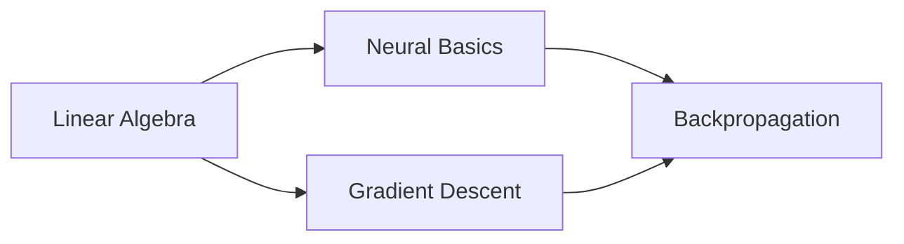
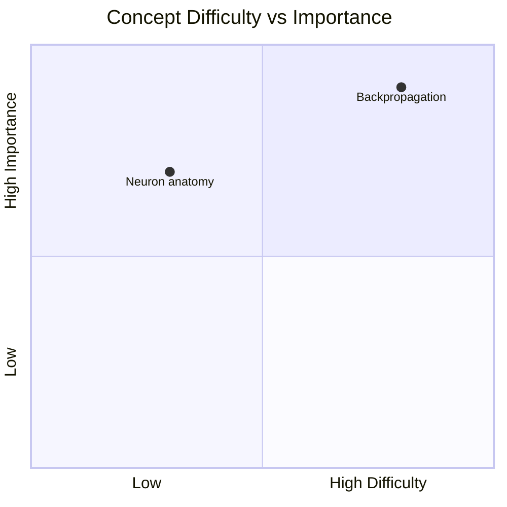

**When to load this file:** Only if you need a syntax reminder for a specific diagram type. One example per type — not a reference manual.

## Concept Hierarchy

## Process Flowchart

## Architecture (with subgraphs)

## Sequence

## State

## Learning-path

## Quadrant

