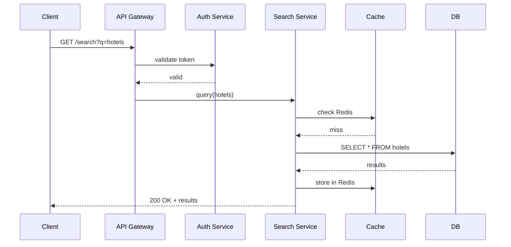
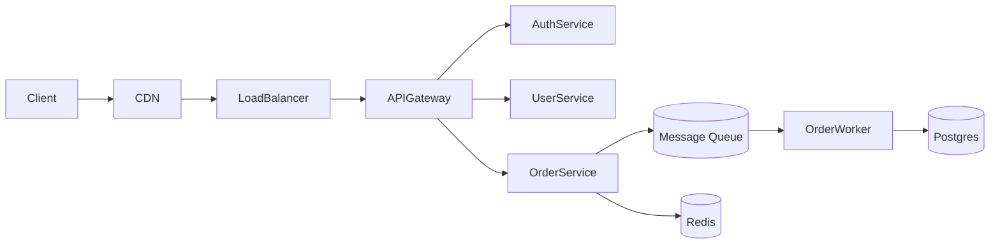
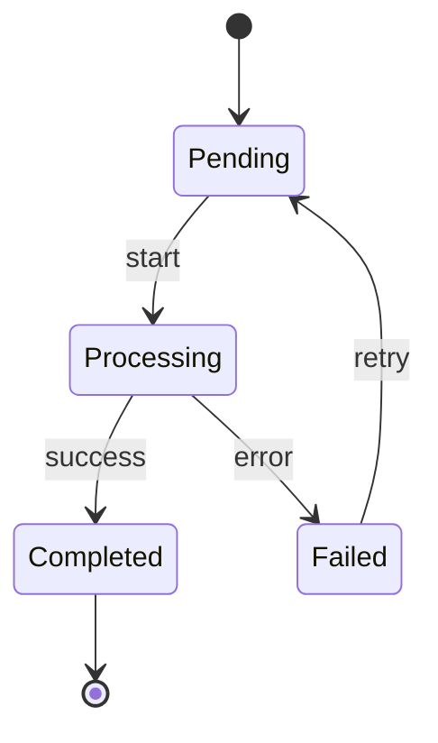
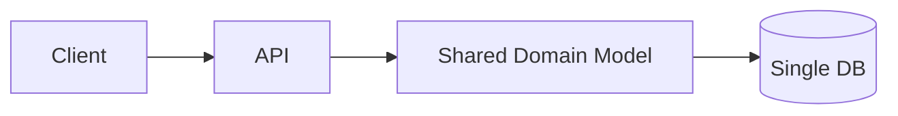
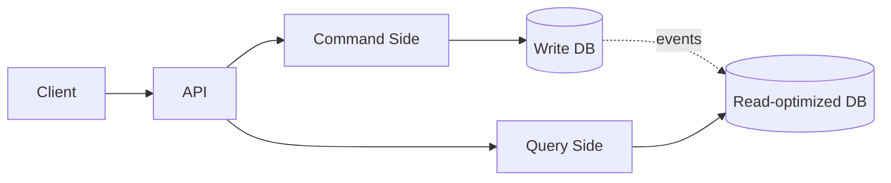

# Visual Guidelines

Visuals are mandatory for any non-trivial concept. Use multiple formats together when it helps — a Mermaid flow diagram plus an ASCII state trace can be very powerful.

---

## Format Selection

| Concept type | Best format |
|--------------|-------------|
| System flow / sequence / architecture | Mermaid |
| Algorithm step-by-step trace | ASCII state table |
| Memory layout, tree, linked list, stack/heap | ASCII art |
| Tensor shapes, NN layers | ASCII art + shape annotations |
| Before/after system comparison | Mermaid (two diagrams) |
| State diagram / FSM | Mermaid state diagram |
| Attention / weighted graph | ASCII grid |

---

## ASCII State Table — Algorithm Traces

For step-by-step algorithm walkthroughs showing how values change each iteration.

```
Binary Search for target=7 in [1, 3, 5, 7, 9, 11]

Step | low | high | mid | arr[mid] | Action
-----|-----|------|-----|----------|--------
  1  |  0  |  5   |  2  |    5     | 5 < 7 → move low to 3
  2  |  3  |  5   |  4  |    9     | 9 > 7 → move high to 3
  3  |  3  |  3   |  3  |    7     | Found! Return 3
```

---

## ASCII Art — Memory Layouts, Trees, Linked Structures

### HashMap (chained collision)

```
HashMap after put("cat",1), put("dog",2), put("act",3):

buckets[]:
  [0] → null
  [1] → null
  [2] → null
  [3] → Node(dog, 2) → null
  [4] → null
  [5] → Node(act, 3) → Node(cat, 1) → null   ← collision! chained
  ...
```

### Binary tree with BFS state

```
     1          After visiting 1:
    / \         visited = {1}
   2   3        queue = [2, 3]
  / \
 4   5          After visiting 2:
                visited = {1, 2}
                queue = [3, 4, 5]
```

### Queue (circular buffer)

```
[_, _, 20, 30, _, _]
     ↑ front    ↑ back
When back hits end, wraps to index 0.
```

### Tensor shapes for a forward pass

```
Input:          (batch=32, seq_len=128, d_model=512)
  ↓ Q, K, V projections
Q, K, V:        each (32, 128, 512)
  ↓ split into heads (h=8)
Q, K, V:        each (32, 8, 128, 64)
  ↓ scaled dot-product attention
attention:      (32, 8, 128, 128)
  ↓ softmax × V
context:        (32, 8, 128, 64)
  ↓ concat heads
output:         (32, 128, 512)
```

---

## Mermaid — Flows, Sequences, Architecture

### Sequence diagram



### Architecture diagram



### State diagram



### Before/after architecture (CQRS example)





---

## Guidelines

- **Prefer fewer, denser visuals over many shallow ones.** One good state trace beats three generic boxes-and-arrows.
- **Label everything.** Pointers, indices, states, dimensions, transitions.
- **Show transitions, not just endpoints.** Before/after pairs or multi-step traces are more instructive than a single snapshot.
- **Use code-block fencing for ASCII** so monospace alignment is preserved.
- **Use Mermaid for anything rendered in modern markdown environments.** Fall back to ASCII if rendering target is uncertain.

---

## If You Can't Visualize It, You Don't Understand It

If you're about to explain something and realize you can't cleanly picture the internal state, step back and work it out before writing. The visual is often where your own understanding either solidifies or exposes a gap.
