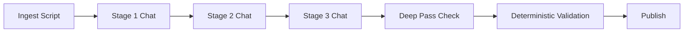

# Usage Guide

Practical, provider-agnostic runbook for converting transcripts into deterministic, publish-ready tutorial notes.

## Quick Start

```bash
cd /Users/praxlannister/Documents/Zoom/transcript-pipeline-kit
python3 scripts/run_chat_pipeline.py run "<transcript_or_session_path>" --deep-pass
```

This command:

1. Runs deterministic ingestion.
2. Checks stage output contracts.
3. Pauses for chat-driven stages when needed.
4. Enforces strict deep tutorial quality (`--deep-pass`).
5. Runs deterministic coverage validation.
6. Publishes standardized learner filename.

## Deterministic Contract

Mandatory deterministic artifacts:

- `.pipeline/segment_ledger.jsonl`
- `.pipeline/segment_manifest.jsonl`
- `.pipeline/coverage_matrix.json`
- `.pipeline/validation_report.md`
- `.pipeline/exceptions.json`

Optional strict quality artifacts (when `--deep-pass` is enabled):

- `.pipeline/deep_pass_report.md`
- `.pipeline/deep_pass_exceptions.json`

## End-to-End Flow



## Commands

### Run pipeline

```bash
python3 scripts/run_chat_pipeline.py run "<transcript_or_session_path>"
python3 scripts/run_chat_pipeline.py run "<transcript_or_session_path>" --deep-pass
python3 scripts/run_chat_pipeline.py run "<transcript_or_session_path>" --skip-ingest
python3 scripts/run_chat_pipeline.py run "<transcript_or_session_path>" --non-interactive
```

### Validate only

```bash
python3 scripts/run_chat_pipeline.py validate "<session_dir>"
python3 scripts/run_chat_pipeline.py validate "<session_dir>" --deep-pass
```

### Status

```bash
python3 scripts/run_chat_pipeline.py status "<session_dir>"
```

### Individual scripts

```bash
python3 scripts/ingest_zoom_captions.py "<transcript_or_session_path>"
python3 scripts/validate_coverage.py \
  --ledger "<session>/.pipeline/segment_ledger.jsonl" \
  --final-notes "<session>/final_notes.md" \
  --coverage-matrix "<session>/.pipeline/coverage_matrix.json" \
  --uncertainty-report "<session>/.pipeline/uncertainty_report.json" \
  --report-out "<session>/.pipeline/validation_report.md" \
  --exceptions-out "<session>/.pipeline/exceptions.json"
python3 scripts/publish_tutorial_notes.py --session-dir "<session_dir>" --root "/Users/praxlannister/Documents/Zoom"
```

## Strict Quality Gate: `--deep-pass`

When enabled, the runner fails if `final_notes.md` does not include all of:

- Prerequisite rescue section
- Intuition depth markers (minimum threshold)
- Mermaid diagram block(s)
- HOTS section with actionable questions
- FAQ section with multiple Q/A entries
- Practice plan/roadmap section

Failure exits with non-zero status and writes:

- `.pipeline/deep_pass_report.md`
- `.pipeline/deep_pass_exceptions.json`

## Stage Prompts (Provider-Agnostic)

Run each chat stage in a fresh conversation for best context hygiene.

### Stage 1: Refine
- Prompt: `docs/prompts/stages/stage1-refine.md`
- Outputs:
  - `.pipeline/refined_transcript.md`
  - `.pipeline/topic_inventory.json`
  - `.pipeline/corrections_log.csv`
  - `.pipeline/uncertainty_report.json`

### Stage 2: Synthesize
- Prompt: `docs/prompts/stages/stage2-synthesize.md`
- Outputs:
  - `.pipeline/structured_notes.md`
  - `.pipeline/coverage_matrix.json`

### Stage 3: Enhance
- Prompt: `docs/prompts/stages/stage3-enhance.md`
- Reference: `docs/prompts/references/tutorial-tech-bar-raiser.md`
- Outputs:
  - `.pipeline/enhanced_notes.md`
  - `final_notes.md`
  - `bootcamp_index.md`

### Stage 4: Validate
- Prompt (chat assist): `docs/prompts/stages/stage4-validate.md`
- Deterministic source of truth: `scripts/validate_coverage.py`

## Chat Provider Portability

This workflow is portable to any chat provider because:

- Prompts are plain Markdown files.
- Deterministic checks are local Python scripts.
- No provider-specific API keys are required for pipeline integrity.

## Large Transcript Handling

If transcript size is too large for a single stage input:

1. Split Stage 1 into chunks.
2. Process each chunk independently with Stage 1 prompt.
3. Merge chunk outputs:

```bash
python3 scripts/merge_chunks.py --chunk-dirs "<chunkA/.pipeline>" "<chunkB/.pipeline>" --output-dir "<session>/.pipeline"
```

4. Continue Stage 2 onward on merged artifacts.

## Troubleshooting

- Missing stage artifacts:
  - Check `.pipeline/stage*_chat_handoff.md` for exact missing files.
- Validation fail:
  - Inspect `.pipeline/exceptions.json` and patch only missing coverage.
- Deep-pass fail:
  - Inspect `.pipeline/deep_pass_report.md` and add missing sections in `final_notes.md`.
- Publish warning:
  - `final_notes.md` remains valid; rerun `publish_tutorial_notes.py`.

## Canonical References

- `readme.md`
- `colab-notebook-explainer-pipeline.md`
- `resource-enrichment-authenticated-flow.md`
- `transcript-intelligence-master-blueprint.md`
- `multi-agent-contribution-sop.md`
- `chat-provider-orchestration-guide.md`

## Colab Notebook Explainer Pipeline (AI/ML)

Use this when class notes include official Colab notebooks and you want deep code pedagogy (imports, functions, cell flow, line-by-line commentary).

```bash
cd /Users/praxlannister/Documents/Zoom/transcript-pipeline-kit
python3 scripts/run_colab_notebook_pipeline.py
```

Single class:

```bash
python3 scripts/run_colab_notebook_pipeline.py --only week5_tensors_pytorch
```

Dry run:

```bash
python3 scripts/run_colab_notebook_pipeline.py --dry-run
```

## Resource Enrichment Pipeline (Authenticated)

Use this when class resources are URLs (Notion/Canva/Drive/etc.) and you want deeper extraction artifacts.

Run for all sessions with resource manifests:

```bash
cd /Users/praxlannister/Documents/Zoom/transcript-pipeline-kit
python3 scripts/resource_enrichment.py --all-sessions
```

Run for a single session:

```bash
python3 scripts/resource_enrichment.py \
  --session-dir "/Users/praxlannister/Documents/Zoom/<SESSION_DIR>"
```

Notion authenticated extraction:

```bash
export NOTION_TOKEN_V2="..."
export NOTION_ACTIVE_USER="..."
python3 scripts/resource_enrichment.py --all-sessions
```

Canva authenticated capture (Playwright storage state):

```bash
export RESOURCE_PLAYWRIGHT_STORAGE_STATE="/absolute/path/to/storage_state.json"
python3 scripts/resource_enrichment.py --all-sessions
```

Outputs per session:

- `.resources/resource_enrichment_report.json`
- provider snapshots (`.html`, `.pdf`, `.png`)
- Notion deep extraction files (`*.notion.md`, `*.notion.raw.json`) when auth is provided
