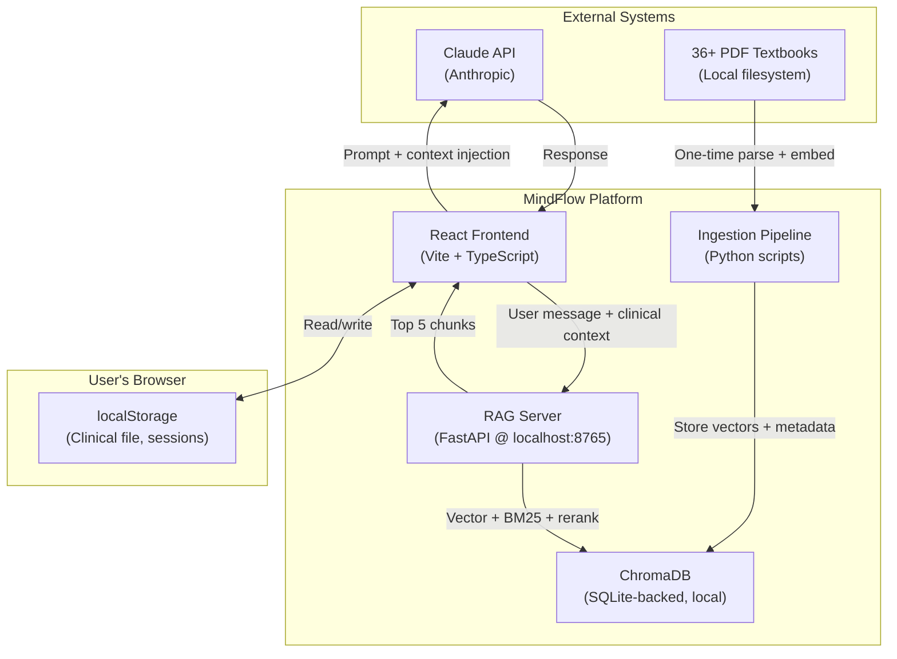
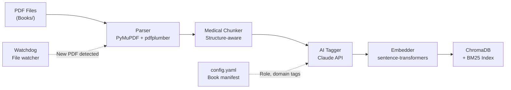
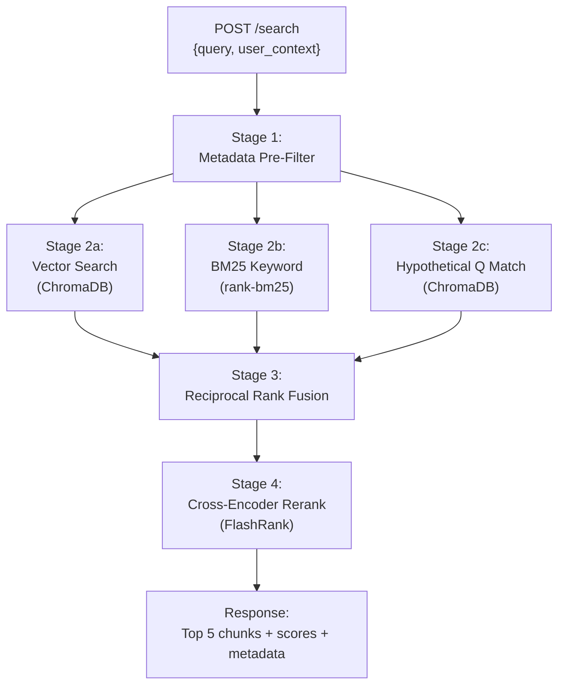
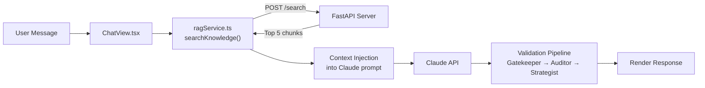
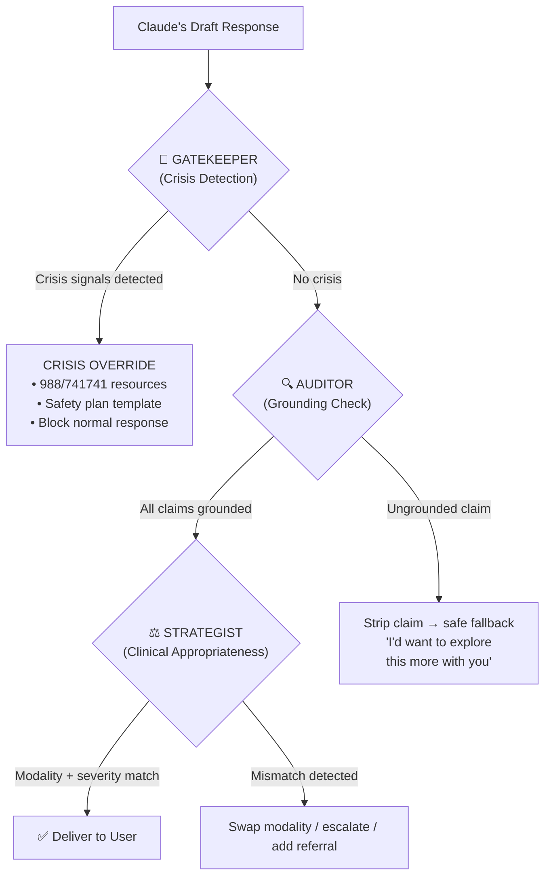

# Architecture HLD — MindFlow RAG System

> **Version**: 3.0 · **Date**: February 12, 2026 · **Classification**: High-Level Design

---

## 1. Executive Summary

MindFlow's RAG system is a **9-layer, local-first clinical retrieval architecture** that grounds Dr. Alex Morgan's therapeutic responses in 36+ curated psychology textbooks. It uses a **4-stage hybrid search pipeline** (vector + BM25 + hypothetical question matching + cross-encoder reranking) with a **3-node clinical validation shield** (Gatekeeper, Auditor, Strategist) to prevent hallucination in a safety-critical medical AI context.

**Design Philosophy**: Phase 1 = Maximum quality, local-first. Every production-grade feature ships from Day 1 using local tools + free cloud fallbacks.

---

## 2. System Context Diagram



---

## 3. Component Architecture

### 3.1 Offline Ingestion Pipeline (Python)

Runs on developer's Mac. One-time per book, re-run when corpus changes.



**Components**:

| Component | Responsibility | Technology |
|-----------|---------------|------------|
| **PDF Parser** | Extract text preserving structure (headings, tables, lists) | PyMuPDF + pdfplumber |
| **Medical Chunker** | Split text respecting clinical boundaries (safety protocols atomic, DSM criteria together) | Custom Python, NLTK |
| **AI Auto-Tagger** | Classify each chunk: role, domain, modality, severity, techniques, hypothetical questions | Claude API (one-time) |
| **Embedder** | Generate 384-dim vectors for semantic search | all-MiniLM-L6-v2 (sentence-transformers) |
| **Storage** | Persist vectors + metadata for search | ChromaDB (SQLite-backed) |
| **BM25 Indexer** | Build keyword search index for exact term matching | rank-bm25 |
| **Watch Folder** | Auto-detect new PDFs and trigger ingestion | watchdog library |

### 3.2 Runtime Search Server (FastAPI)

Runs locally at `localhost:8765`. Lightweight Python server handling search requests.



**Endpoints**:

| Endpoint | Method | Purpose |
|----------|--------|---------|
| `/search` | POST | Hybrid search with reranking |
| `/health` | GET | Server health check |
| `/stats` | GET | Corpus statistics (chunk count, book count) |
| `/ingest` | POST | Trigger ingestion of new book |

### 3.3 React Frontend Integration

The frontend uses a `ragService.ts` abstraction layer that connects to the RAG server.



**Migration path**: Change `VITE_RAG_URL` env variable from `http://localhost:8765` to cloud endpoint. Zero code changes required.

### 3.4 Clinical Validation Pipeline

Three sequential validation nodes run on every AI response before delivery.



---

## 4. Data Flow: End-to-End Request Lifecycle

```
1. User types: "I scored 22 on the PHQ-9 and I can't get out of bed"
2. React reads clinicalFile from localStorage: {diagnoses: ["MDD"], modality: "cbt"}
3. ragService.ts calls POST localhost:8765/search with query + context
4. FastAPI:
   a. Metadata pre-filter: severity_level ∈ [moderate, severe], clinical_domains ∈ [depression]
   b. Vector search: semantically similar chunks (top 20)
   c. BM25 search: keyword match for "PHQ-9" (top 20)
   d. Hypothetical Q match: "What does a PHQ-9 score of 22 mean?" (top 10)
   e. Reciprocal Rank Fusion: merge + deduplicate
   f. FlashRank reranking: precision scoring → top 5
5. Top 5 chunks returned with metadata + scores
6. React injects chunks into Claude system prompt:
   "RETRIEVED CLINICAL CONTEXT: [chunk1] [chunk2] ..."
7. Claude generates response grounded in context
8. Gatekeeper: PHQ-9=22 → severe → checks for crisis language
9. Auditor: verifies "severe depression" claim traces to PHQ-9 scoring guide chunk
10. Strategist: confirms CBT modality matches, severity-appropriate response
11. Response delivered to user with citation metadata attached
```

---

## 5. Deployment Architecture

### Phase 1: Local-First (Current)

```
┌─────────────────────────────────────────────────┐
│  Your Mac                                        │
│                                                   │
│  ┌──────────┐    ┌──────────────┐    ┌────────┐ │
│  │ React    │◄──►│ FastAPI      │◄──►│ChromaDB│ │
│  │ App      │    │ localhost:   │    │(SQLite)│ │
│  │ :5173    │    │ 8765         │    │        │ │
│  └──────────┘    └──────────────┘    └────────┘ │
│       │                                          │
│       ▼                                          │
│  ┌──────────┐                                    │
│  │ Claude   │ (External API only)                │
│  │ API      │                                    │
│  └──────────┘                                    │
└─────────────────────────────────────────────────┘
```

### Phase 2: Cloud Migration

```
┌─────────────┐     ┌────────────────┐     ┌──────────────┐
│ React App   │────►│ FastAPI on     │────►│ Supabase     │
│ (Vercel/    │     │ Railway/Render │     │ pgvector     │
│ Netlify)    │     │ (free tier)    │     │ (500MB free) │
└─────────────┘     └────────────────┘     └──────────────┘
       │
       ▼
┌─────────────┐
│ Claude API  │
└─────────────┘
```

---

## 6. Security & Privacy Architecture

| Concern | Design Decision | Rationale |
|---------|----------------|-----------|
| **User data at rest** | localStorage only (browser) | Zero server storage = zero breach surface |
| **User data in transit** | Direct browser → Claude API (HTTPS) | No intermediary server sees user messages |
| **Book content** | Embedded locally, never sent externally | Copyright protection + offline capability |
| **API keys** | `.env` file, gitignored | Standard secrets management |
| **Clinical file** | localStorage with optional export | User owns their data completely |
| **RAG search queries** | Localhost only (Phase 1) | Queries never leave the machine |

---

## 7. Scalability Considerations

| Dimension | Phase 1 Capacity | Phase 2 Upgrade Path |
|-----------|-----------------|---------------------|
| **Book corpus** | ~36 books (~5,000 chunks) | 200+ books via pgvector |
| **Concurrent users** | 1 (local) | Unlimited (cloud) |
| **Search latency** | <100ms (local) | <300ms (cloud w/ caching) |
| **Embedding dimension** | 384 (MiniLM) | 1536 (OpenAI ada-003) |
| **Storage** | ~50MB (ChromaDB) | 500MB free (Supabase) |

---

## 8. Technology Decisions Reference

See [ADR Log](./08-ADR-LOG.md) for detailed rationale on each technology decision.

| Decision | Choice | Key Alternative | Why |
|----------|--------|----------------|-----|
| Vector DB | ChromaDB | Pinecone, Qdrant | Zero config, SQLite-backed, pip install |
| Reranker | FlashRank | bge-reranker-v2 | ~4ms/query, no GPU, lightweight |
| Embeddings | all-MiniLM-L6-v2 | text-embedding-3 | Free, local, 80MB, well-benchmarked |
| BM25 | rank-bm25 | Elasticsearch | Pure Python, no external deps |
| API Server | FastAPI | Express, Flask | Async, auto-docs, Pydantic validation |
| PDF Parser | PyMuPDF + pdfplumber | Unstructured, LlamaParse | Best text + table extraction combo |

---

*Document maintained as part of MindFlow RAG Architecture v3.0*
