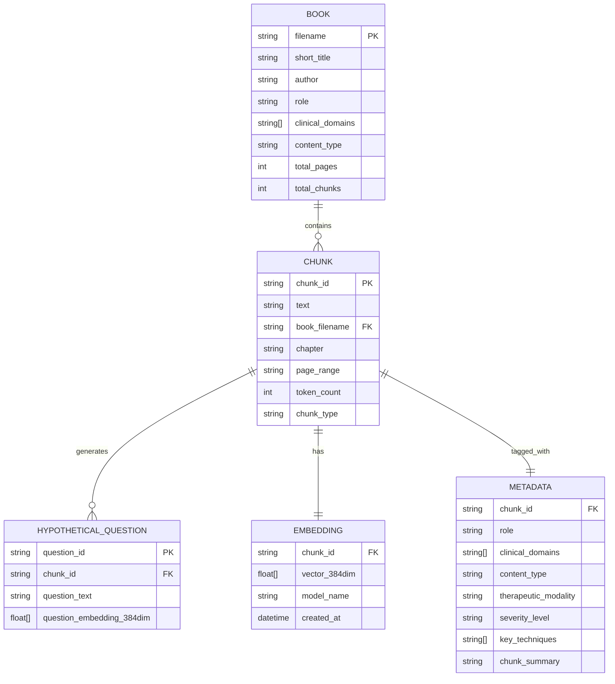

# Data Architecture — MindFlow RAG System

> **Version**: 3.0 · **Date**: February 12, 2026 · **Classification**: Data Design

---

## 1. Data Model Overview



---

## 2. Chunk Schema

### 2.1 Full Chunk Document

Each chunk stored in ChromaDB follows this schema:

```json
{
  "id": "beck_cog_therapy_ch3_p45_001",
  "document": "PHQ-9 SCORING INTERPRETATION: A total score of 20-27 indicates severe depression...",
  "embedding": [0.023, -0.841, 0.192, ...],
  "metadata": {
    "source_book": "Cognitive Therapy of Depression",
    "source_author": "Aaron T. Beck",
    "source_chapter": "Chapter 3: Assessment and Measurement",
    "source_page_range": "44-48",
    "source_short_title": "Cognitive Therapy of Depression",
    "source_filename": "Cognitive Therapy of Depression (Aaron T. Beck).pdf",

    "role": "therapist_reference",
    "clinical_domains": "depression,cbt",
    "content_type": "screening_guide",
    "therapeutic_modality": "cbt",
    "severity_level": "severe",
    "key_techniques": "phq9_interpretation,severity_assessment",

    "chunk_type": "content",
    "chunk_summary": "PHQ-9 scoring guide with clinical action recommendations.",
    "token_count": 342,
    "created_at": "2026-02-12T22:00:00Z"
  }
}
```

> **Note**: ChromaDB stores metadata as flat key-value pairs. Arrays are stored as comma-separated strings and parsed at query time.

### 2.2 Hypothetical Question Document

Stored as separate documents in the same ChromaDB collection with `chunk_type: hypothetical_question`:

```json
{
  "id": "beck_cog_therapy_ch3_p45_001_hq_1",
  "document": "What does a PHQ-9 score of 22 mean?",
  "embedding": [0.045, -0.712, 0.088, ...],
  "metadata": {
    "chunk_type": "hypothetical_question",
    "parent_chunk_id": "beck_cog_therapy_ch3_p45_001",
    "source_book": "Cognitive Therapy of Depression",
    "source_author": "Aaron T. Beck",
    "clinical_domains": "depression,cbt",
    "severity_level": "severe"
  }
}
```

---

## 3. Metadata Taxonomy

### 3.1 Role Classification

| Value | Count (est.) | Description | How Dr. Alex Uses It |
|-------|-------------|-------------|---------------------|
| `therapist_reference` | ~2,500 | Clinical manuals, protocols, DSM criteria | Internal knowledge — never names source unless asked |
| `recommend_to_user` | ~4,000 | Self-help books, workbooks, exercises | Can suggest by name: "You might enjoy reading..." |

### 3.2 Clinical Domains

| Domain | Example Books | Expected Chunks |
|--------|--------------|----------------|
| `depression` | Beck, Burns, Ilardi, O'Connor, Hari, Korb | ~1,800 |
| `adhd` | Hallowell, Barkley, McCabe, Ramsay, Safren, Tuckman | ~1,600 |
| `anxiety` | Bourne, McDonagh, Pittman, Smith | ~1,000 |
| `cbt` | Beck, Burns, Ramsay | ~1,400 |
| `dbt` | McKay & Wood | ~650 |
| `act` | Harris, Hayes | ~500 |
| `executive_function` | Dawson, Ratey, Steel | ~700 |
| `behavior_change` | Clear, Fogg | ~450 |
| `neuroscience` | Doidge, Korb, Pittman | ~400 |
| `self_compassion` | Neff | ~250 |
| `procrastination` | Steel | ~200 |
| `mindfulness` | Williams | ~300 |

### 3.3 Content Types

| Type | Description | Chunking Strategy |
|------|------------|------------------|
| `diagnostic_criteria` | DSM-5 criteria sets | Entire criterion set = 1 chunk |
| `intervention` | Therapeutic techniques and protocols | 1 technique = 1 chunk |
| `worksheet` | Fill-in exercises, thought records | Entire worksheet = 1 chunk |
| `psychoeducation` | Explanatory content about conditions | Heading-based, 400-800 tokens |
| `screening_guide` | PHQ-9, GAD-7, ASRS scoring guides | Entire tool = 1 chunk |
| `safety_protocol` | Crisis response, safety plans | Atomic — never split |
| `exercise` | Mindfulness, grounding, behavioral tasks | 1 exercise = 1 chunk |
| `case_study` | Clinical examples and vignettes | 1 case = 1 chunk |

### 3.4 Therapeutic Modalities

| Modality | Full Name | Key Books |
|----------|-----------|-----------|
| `cbt` | Cognitive Behavioral Therapy | Beck, Burns, Ramsay |
| `dbt` | Dialectical Behavior Therapy | McKay & Wood |
| `act` | Acceptance and Commitment Therapy | Harris, Hayes |
| `mbct` | Mindfulness-Based Cognitive Therapy | Williams |
| `mi` | Motivational Interviewing | — |
| `ba` | Behavioral Activation | Ilardi, Martell |
| `general` | Non-modality-specific | Doidge, Clear, Fogg |

### 3.5 Severity Levels

| Level | PHQ-9 Range | GAD-7 Range | When Used |
|-------|------------|------------|-----------|
| `mild` | 5-9 | 5-9 | General coping, psychoeducation |
| `moderate` | 10-14 | 10-14 | Active intervention, skill building |
| `severe` | 15-27 | 15-21 | Intensive intervention, referral consideration |
| `crisis` | N/A | N/A | Safety protocols, crisis resources |
| `all` | Any | Any | Universal content (lifestyle, habits) |

---

## 4. Storage Architecture

### 4.1 ChromaDB (Phase 1 — Local)

```
rag-pipeline/output/
└── chroma_db/              # ChromaDB persistent storage
    ├── chroma.sqlite3       # SQLite database (vectors + metadata)
    └── ...                  # Internal ChromaDB files
```

| Property | Value |
|----------|-------|
| Engine | SQLite (embedded) |
| Collection name | `mindflow_knowledge` |
| Distance function | Cosine similarity |
| Estimated size | ~50MB for 36 books |

### 4.2 BM25 Index (Phase 1 — Local)

```python
# Stored as pickled Python object
rag-pipeline/output/
└── bm25_index.pkl          # Serialized BM25Okapi instance
```

| Property | Value |
|----------|-------|
| Library | rank-bm25 (BM25Okapi) |
| Vocabulary | ~40,000 unique terms |
| Index format | Pickled Python object |
| Estimated size | ~5MB |

### 4.3 Supabase pgvector (Phase 2 — Cloud)

```sql
-- Schema for Phase 2 migration
CREATE TABLE chunks (
    id TEXT PRIMARY KEY,
    content TEXT NOT NULL,
    embedding VECTOR(384),
    source_book TEXT,
    source_author TEXT,
    source_chapter TEXT,
    source_page_range TEXT,
    role TEXT CHECK (role IN ('therapist_reference', 'recommend_to_user')),
    clinical_domains TEXT[],
    content_type TEXT,
    therapeutic_modality TEXT,
    severity_level TEXT,
    key_techniques TEXT[],
    chunk_summary TEXT,
    chunk_type TEXT DEFAULT 'content',
    parent_chunk_id TEXT REFERENCES chunks(id),
    token_count INT,
    created_at TIMESTAMPTZ DEFAULT NOW()
);

CREATE INDEX ON chunks USING ivfflat (embedding vector_cosine_ops) WITH (lists = 100);
CREATE INDEX ON chunks (role);
CREATE INDEX ON chunks USING gin (clinical_domains);
CREATE INDEX ON chunks (severity_level);
CREATE INDEX ON chunks (therapeutic_modality);
CREATE INDEX ON chunks (chunk_type);
```

---

## 5. Embedding Strategy

### 5.1 Model Selection

| Phase | Model | Dimensions | Speed | Quality |
|-------|-------|-----------|-------|---------|
| Phase 1 | all-MiniLM-L6-v2 | 384 | ~200 chunks/sec (CPU) | Good |
| Phase 2 | text-embedding-3-small | 1536 | ~100 chunks/sec (API) | Excellent |

### 5.2 Embedding Pipeline

```
Raw Text Chunk
    │
    ▼
Preprocessing:
  - Strip markdown formatting
  - Normalize whitespace
  - Truncate to max 256 tokens
    │
    ▼
sentence-transformers encode()
    │
    ▼
384-dim float32 vector
    │
    ▼
ChromaDB .add() with metadata
```

---

## 6. Config Schema (`config.yaml`)

```yaml
# Book manifest for AI tagging and ingestion
corpus:
  books_directory: "../../Books"  # Relative to rag-pipeline/
  output_directory: "./output"

embedding:
  model: "all-MiniLM-L6-v2"
  dimension: 384
  batch_size: 64

chunking:
  default_size: 512
  overlap: 50
  min_chunk_size: 100
  max_chunk_size: 800

tagging:
  model: "claude-sonnet-4-20250514"
  batch_size: 10
  retry_attempts: 3

books:
  - filename: "Feeling Good The New Mood Therapy (David D. Burns).pdf"
    role: recommend_to_user
    clinical_domains: [depression, cbt]
    content_type: self_help_workbook
    author: "David D. Burns"
    short_title: "Feeling Good"

  - filename: "Cognitive Therapy of Depression (Aaron T. Beck).pdf"
    role: therapist_reference
    clinical_domains: [depression, cbt]
    content_type: clinical_manual
    author: "Aaron T. Beck"
    short_title: "Cognitive Therapy of Depression"

  # ... (all 36 books)
```

---

*Document maintained as part of MindFlow RAG Architecture v3.0*
