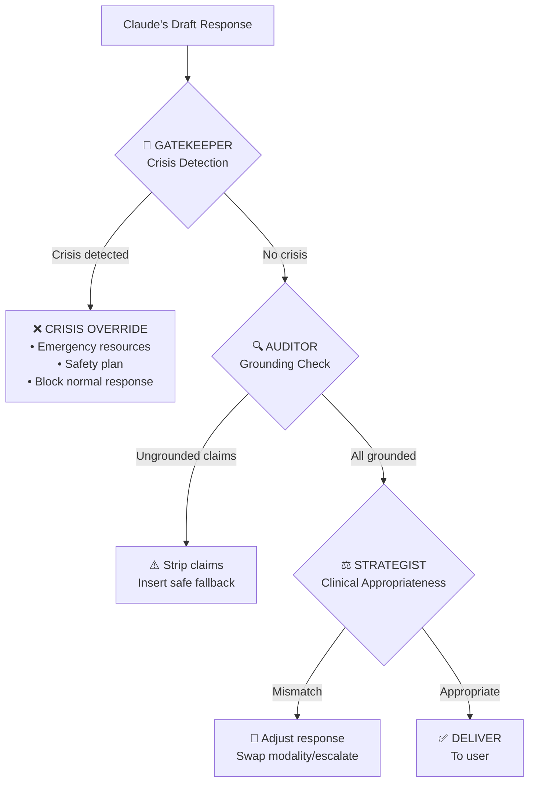

# Validation Pipeline — MindFlow RAG System

> **Version**: 3.0 · **Date**: February 12, 2026 · **Classification**: Clinical Safety Design

---

## 1. Overview

The validation pipeline is a **3-node sequential shield** that runs between Claude's draft response and user delivery. Its purpose is to prevent harmful, ungrounded, or clinically inappropriate content from reaching the user.



> **Critical design principle**: Bad retrieval is worse than no retrieval — especially in medical AI. When given poor context, LLMs become *more* confident, not less. This pipeline treats anti-hallucination as a **patient safety** concern.

---

## 2. Node 1: Gatekeeper (Crisis Detection)

### Purpose

Detect any signal that the user may be in crisis, regardless of how the message is framed. This node runs **first** and can **completely override** the normal response pipeline.

### Detection Signals

| Signal Category | Examples | Confidence |
|----------------|----------|-----------|
| **Explicit keywords** | "suicide", "kill myself", "want to die", "self-harm", "cutting" | High |
| **Implicit language** | "no point in going on", "everyone would be better off", "can't do this anymore" | Medium |
| **PHQ-9 severity** | Score ≥ 20, or Question 9 (self-harm ideation) > 0 | High |
| **Behavioral indicators** | Sudden mood shift from engaged to withdrawn across sessions | Medium |
| **Method mentions** | Any mention of specific methods of self-harm | Critical |

### Crisis Response Protocol

```json
{
  "crisis_detected": true,
  "severity": "high",
  "signals": ["phq9_q9_positive", "explicit_keyword_found"],
  "response_override": {
    "message": "I hear that you're going through an incredibly difficult time, and I want you to know that you don't have to face this alone. Please reach out to one of these resources right now:",
    "resources": [
      {"name": "988 Suicide & Crisis Lifeline", "contact": "Call or text 988", "available": "24/7"},
      {"name": "Crisis Text Line", "contact": "Text HOME to 741741", "available": "24/7"},
      {"name": "International Association for Suicide Prevention", "contact": "https://www.iasp.info/resources/Crisis_Centres/", "available": "Directory"}
    ],
    "follow_up": "If you're comfortable sharing, I'd like to walk through a safety plan with you. Would that feel okay?",
    "safety_plan_offer": true
  }
}
```

### Implementation

```typescript
// src/services/validation/gatekeeper.ts

interface GatekeeperResult {
  crisisDetected: boolean;
  severity: 'low' | 'medium' | 'high' | 'critical';
  signals: string[];
  responseOverride?: CrisisResponse;
}

function runGatekeeper(
  userMessage: string,
  aiResponse: string,
  clinicalContext: ClinicalContext
): GatekeeperResult {
  const signals: string[] = [];

  // Check 1: Explicit keyword scan
  const crisisKeywords = CRISIS_KEYWORD_LIST;
  // ...

  // Check 2: PHQ-9 Question 9
  if (clinicalContext.phq9_q9_score && clinicalContext.phq9_q9_score > 0) {
    signals.push('phq9_q9_positive');
  }

  // Check 3: PHQ-9 total score
  if (clinicalContext.phq9_score && clinicalContext.phq9_score >= 20) {
    signals.push('phq9_severe');
  }

  // Check 4: Implicit language patterns (regex-based)
  // ...

  return {
    crisisDetected: signals.length > 0,
    severity: calculateSeverity(signals),
    signals,
    responseOverride: signals.length > 0 ? buildCrisisResponse(signals) : undefined
  };
}
```

### Requirements

| Requirement | Target |
|------------|--------|
| **Detection rate** | 100% — zero tolerance for missed crises |
| **False positive rate** | ≤ 5% — acceptable collateral |
| **Latency** | < 10ms (keyword/regex, no API call) |
| **Fallback** | If Gatekeeper crashes, block response entirely |

---

## 3. Node 2: Auditor (Grounding Check)

### Purpose

Verify that every clinical claim in Claude's response is **grounded** in the retrieved context chunks. Strip any ungrounded claims.

### How It Works

The Auditor operates via a **Claude post-generation system prompt instruction** injected into the LLM call. Rather than a separate API call, it's baked into the original generation:

```
GROUNDING RULES (MANDATORY):
1. Every clinical technique or therapeutic concept you describe MUST come from
   the RETRIEVED CLINICAL CONTEXT above.
2. If the user asks about something not covered in the context:
   - DO NOT make up information
   - Say: "That's an important question. I'd want to make sure I give you
     accurate information on that. Could we explore what you already know
     about it?"
3. If you cite a study or statistic, it MUST appear in the retrieved context.
   Never fabricate research.
4. If two chunks contradict each other, acknowledge the complexity:
   "Different approaches suggest different perspectives on this..."
5. For safety protocols, use ONLY the exact wording from retrieved safety
   protocol chunks.
```

### Post-Generation Verification

In addition to the system prompt, a lightweight TypeScript check validates the response:

```typescript
// src/services/validation/auditor.ts

interface AuditResult {
  grounded: boolean;
  groundingScore: number;         // 0.0 - 1.0
  ungroundedClaims: string[];     // Flagged sentences
  modifiedResponse?: string;      // Response with claims stripped
}

function runAuditor(
  aiResponse: string,
  retrievedChunks: SearchResult[]
): AuditResult {
  // Check 1: Extract therapeutic technique mentions
  const techniques = extractTechniqueMentions(aiResponse);

  // Check 2: Verify each technique appears in retrieved chunks
  const ungrounded = techniques.filter(
    t => !chunksContainTechnique(retrievedChunks, t)
  );

  // Check 3: If ungrounded claims found, strip them
  if (ungrounded.length > 0) {
    const modified = stripUngroundedClaims(aiResponse, ungrounded);
    return {
      grounded: false,
      groundingScore: 1 - (ungrounded.length / techniques.length),
      ungroundedClaims: ungrounded,
      modifiedResponse: modified
    };
  }

  return {
    grounded: true,
    groundingScore: 1.0,
    ungroundedClaims: []
  };
}
```

### Safe Fallback Phrases

When the Auditor strips a claim, it replaces with:

| Claim Type | Replacement |
|-----------|------------|
| Unknown technique | "There are several approaches we could explore for this..." |
| Fabricated statistic | *(Sentence removed entirely)* |
| Unsupported diagnosis | "I notice some patterns here. A mental health professional could help clarify..." |
| Wrong attribution | *(Citation removed, content kept if factual)* |

### Requirements

| Requirement | Target |
|------------|--------|
| **Grounding rate** | ≥ 90% of claims traced to chunks |
| **Detection accuracy** | ≥ 85% for technique mentions |
| **Latency** | < 50ms (local string matching) |
| **Hallucination rate** | < 2% after filtering |

---

## 4. Node 3: Strategist (Clinical Appropriateness)

### Purpose

Ensure the response matches the user's **current clinical profile** — right modality, right severity level, right therapeutic boundary.

### Checks Performed

| Check | What It Validates | Action on Failure |
|-------|------------------|------------------|
| **Modality match** | Response uses techniques from user's active modality (CBT, DBT, ACT) | Swap to correct modality techniques |
| **Severity match** | Response intensity matches screening scores | Escalate for severe; de-escalate for mild |
| **Scope boundary** | No medication recommendations, no diagnoses | Strip and add disclaimer |
| **Referral trigger** | Severe symptoms or complex comorbidities | Add professional referral suggestion |
| **Repetition check** | Not repeating techniques from recent sessions | Suggest alternative technique |
| **Cultural sensitivity** | No culturally inappropriate assumptions | Flag for review (future enhancement) |

### Implementation

```typescript
// src/services/validation/strategist.ts

interface StrategyResult {
  appropriate: boolean;
  adjustments: Adjustment[];
  modifiedResponse?: string;
  referralSuggested: boolean;
}

interface Adjustment {
  type: 'modality_swap' | 'severity_mismatch' | 'scope_violation' |
        'repetition' | 'referral_needed';
  description: string;
  action: string;
}

function runStrategist(
  aiResponse: string,
  userContext: ClinicalContext,
  sessionHistory: SessionHistory,
  retrievedChunks: SearchResult[]
): StrategyResult {
  const adjustments: Adjustment[] = [];

  // Check 1: Modality match
  if (userContext.therapeutic_modality) {
    const responseTechniques = extractTechniques(aiResponse);
    const wrongModality = responseTechniques.filter(
      t => t.modality !== userContext.therapeutic_modality && t.modality !== 'general'
    );
    if (wrongModality.length > 0) {
      adjustments.push({
        type: 'modality_swap',
        description: `Response uses ${wrongModality[0].modality} techniques but user is on ${userContext.therapeutic_modality}`,
        action: 'Swap to equivalent modality technique'
      });
    }
  }

  // Check 2: Severity match
  const phq9 = userContext.phq9_score;
  if (phq9 && phq9 >= 20) {
    // Severe — response should include referral language
    if (!containsReferralLanguage(aiResponse)) {
      adjustments.push({
        type: 'referral_needed',
        description: 'PHQ-9 ≥ 20 but response lacks professional referral',
        action: 'Append referral suggestion'
      });
    }
  }

  // Check 3: Scope violations
  if (containsMedicationRecommendation(aiResponse)) {
    adjustments.push({
      type: 'scope_violation',
      description: 'Response recommends specific medication',
      action: 'Strip medication reference, add "discuss with prescriber"'
    });
  }

  // Check 4: Repetition
  if (sessionHistory) {
    const recentTechniques = getRecentTechniques(sessionHistory, 3);
    const repeated = extractTechniques(aiResponse).filter(
      t => recentTechniques.includes(t.name)
    );
    if (repeated.length === extractTechniques(aiResponse).length) {
      adjustments.push({
        type: 'repetition',
        description: 'All suggested techniques were used in recent sessions',
        action: 'Suggest alternative technique from same modality'
      });
    }
  }

  return {
    appropriate: adjustments.length === 0,
    adjustments,
    modifiedResponse: adjustments.length > 0 ? applyAdjustments(aiResponse, adjustments) : undefined,
    referralSuggested: adjustments.some(a => a.type === 'referral_needed')
  };
}
```

### Requirements

| Requirement | Target |
|------------|--------|
| **Modality match rate** | ≥ 95% — correct modality techniques used |
| **Scope violations** | 0% — no medication or diagnostic claims pass through |
| **Referral accuracy** | 100% for severe PHQ-9 |
| **Latency** | < 30ms (rule-based logic) |

---

## 5. Pipeline Orchestration

```typescript
// src/services/validation/pipeline.ts

async function validateResponse(
  userMessage: string,
  aiResponse: string,
  userContext: ClinicalContext,
  searchResults: SearchResult[],
  sessionHistory: SessionHistory
): Promise<ValidatedResponse> {

  // Stage 1: Gatekeeper (ALWAYS runs first)
  const gatekeeper = runGatekeeper(userMessage, aiResponse, userContext);
  if (gatekeeper.crisisDetected) {
    return {
      response: gatekeeper.responseOverride!.message,
      type: 'crisis_override',
      metadata: { signals: gatekeeper.signals, severity: gatekeeper.severity }
    };
  }

  // Stage 2: Auditor (strip ungrounded claims)
  const auditor = runAuditor(aiResponse, searchResults);
  const auditedResponse = auditor.modifiedResponse || aiResponse;

  // Stage 3: Strategist (clinical appropriateness)
  const strategist = runStrategist(
    auditedResponse, userContext, sessionHistory, searchResults
  );
  const finalResponse = strategist.modifiedResponse || auditedResponse;

  return {
    response: finalResponse,
    type: 'validated',
    metadata: {
      grounded: auditor.grounded,
      groundingScore: auditor.groundingScore,
      adjustments: strategist.adjustments,
      referralSuggested: strategist.referralSuggested
    }
  };
}
```

---

## 6. Failure Modes & Fallbacks

| Failure | Behavior |
|---------|----------|
| Gatekeeper crashes | **Block response entirely** — show "I'm experiencing a brief issue. If you need immediate support, please text HOME to 741741." |
| Auditor crashes | Deliver response with warning flag for logging |
| Strategist crashes | Deliver audited response without strategy checks |
| No search results | Claude responds without context, with disclaimer: "I'm drawing on general knowledge here..." |
| All nodes pass | Deliver response normally |

---

*Document maintained as part of MindFlow RAG Architecture v3.0*
