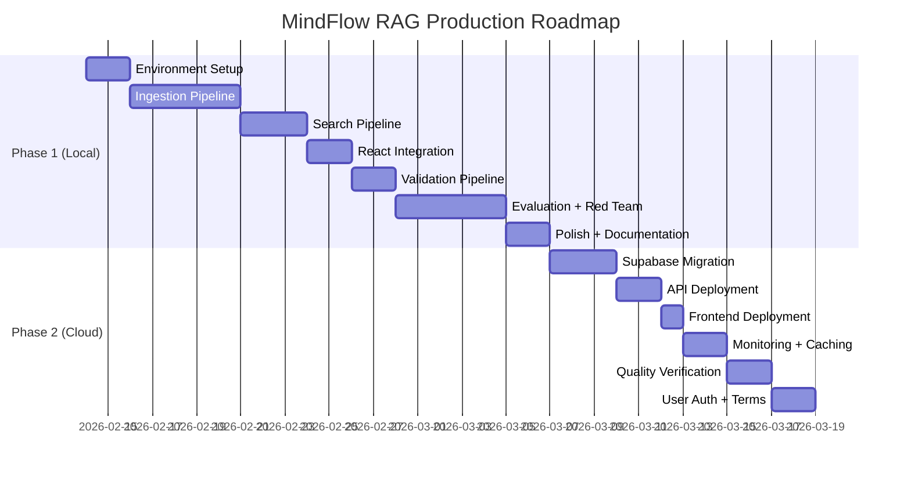

# Production BRD — MindFlow RAG System

> **Version**: 3.0 · **Date**: February 12, 2026 · **Classification**: Business Requirements (Production Readiness)

---

## 1. Purpose

This document defines the business and technical requirements to transition MindFlow from a **local-first developer tool** (Phase 1) to a **production-ready, publicly accessible application** (Phase 2+). It covers cloud migration, user management, compliance, and growth considerations.

---

## 2. Business Context

### 2.1 Current State (Phase 1 — Local)

| Dimension | Phase 1 Status |
|-----------|---------------|
| **Users** | Single developer (local) |
| **Deployment** | localhost |
| **Data** | All local (ChromaDB + localStorage) |
| **Cost** | Claude API only (~$10-30/month for personal use) |
| **Availability** | Only when developer's Mac is running |

### 2.2 Target State (Phase 2 — Cloud)

| Dimension | Phase 2 Target |
|-----------|---------------|
| **Users** | Up to 100 concurrent (free tier limits) |
| **Deployment** | Cloud-hosted (Railway/Render + Supabase + Vercel/Netlify) |
| **Data** | Supabase pgvector (cloud) + client-side localStorage |
| **Cost** | $0 (all free-tier services) |
| **Availability** | 24/7 (cloud provider SLAs) |

---

## 3. Cloud Architecture Requirements

### 3.1 Service Selection

| Service | Provider | Free Tier Limits | MindFlow Usage (Est.) |
|---------|----------|-----------------|----------------------|
| **Vector DB** | Supabase (pgvector) | 500MB storage, 50K MAU | ~50MB vectors + metadata |
| **API Hosting** | Railway or Render | 500 hrs/month | ~720 hrs/month needed (always-on) |
| **Frontend** | Vercel or Netlify | 100GB bandwidth | ~5GB/month |
| **Caching** | Upstash Redis | 10K commands/day | ~2K commands/day |
| **Monitoring** | Sentry | 5K errors/month | ~100 errors/month |
| **Analytics** | PostHog | 1M events/month | ~50K events/month |

> [!WARNING]
> Railway's free tier provides 500 hours/month, which is ~20.8 days of continuous uptime. For always-on availability, consider Render's free tier (spins down after 15 min inactivity) or upgrading to Railway's Hobby plan ($5/month). Alternatively, deploy as a serverless function on Vercel.

### 3.2 Migration Checklist

- [ ] Set up Supabase project with pgvector extension enabled
- [ ] Create `chunks` table with schema from Data Architecture doc
- [ ] Export ChromaDB data → migrate to pgvector via Python script
- [ ] Verify search quality parity (Golden Set on pgvector ≥ Golden Set on ChromaDB)
- [ ] Deploy FastAPI to Railway/Render with environment variables
- [ ] Update `VITE_RAG_URL` from `localhost:8765` to cloud endpoint
- [ ] Deploy React app to Vercel/Netlify
- [ ] Set up Sentry error tracking
- [ ] Configure Upstash Redis for search caching
- [ ] End-to-end integration test on cloud

---

## 4. User Management Requirements

### 4.1 Phase 2 (Basic)

| Requirement | Implementation |
|------------|---------------|
| **Authentication** | Supabase Auth (magic link or social login) |
| **User isolation** | Each user's clinical file in localStorage (client-side only) |
| **Usage limits** | Rate limit: 60 search requests/hour per user |
| **Privacy** | No server-side user data storage (all in browser) |

### 4.2 Phase 3 (Future)

| Requirement | Implementation |
|------------|---------------|
| **User accounts** | Full Supabase Auth with profiles |
| **Session persistence** | Optional server-side session storage (encrypted) |
| **Multi-device sync** | Encrypted clinical file sync via Supabase |
| **Team features** | Therapist dashboard for supervised use |

---

## 5. Compliance & Ethics

### 5.1 Phase 2 Requirements

| Area | Requirement | Status |
|------|-----------|--------|
| **Disclaimer** | Clear "Not a substitute for professional care" on every page | Required |
| **Terms of Service** | User agrees to therapeutic tool limitations | Required |
| **Privacy Policy** | Transparent data handling documentation | Required |
| **Crisis protocol** | 988/741741 resources always visible | Already in Phase 1 |
| **Age restriction** | 18+ only (or with parental consent) | Required |
| **Cookie consent** | localStorage usage disclosure | Required |

### 5.2 Regulatory Considerations (Future)

| Regulation | Applicability | Notes |
|-----------|--------------|-------|
| **HIPAA** | Only if collecting PHI on servers | Phase 1-2: No PHI on servers |
| **GDPR** | If serving EU users | Minimal data collection = low risk |
| **APA Ethics** | AI therapy tool best practices | Follow APA guidelines for AI-assisted therapy |
| **FDA** | Software as Medical Device (SaMD) | Not applicable if positioned as "wellness tool" |

> [!IMPORTANT]
> MindFlow must always be positioned as a **therapy-informed wellness tool** — NOT as a replacement for licensed therapy. This positioning is critical for both ethics and regulatory compliance.

---

## 6. Performance Requirements (Cloud)

| Metric | Phase 1 (Local) | Phase 2 (Cloud) |
|--------|-----------------|-----------------|
| **Search latency (p95)** | < 100ms | < 300ms |
| **End-to-end response** | < 5s | < 8s |
| **Concurrent users** | 1 | 100 |
| **Uptime** | When Mac runs | 99.5% |
| **Cold start** | < 2s | < 10s (Render free tier spin-up) |

---

## 7. Cost Projection

### 7.1 Phase 2 Monthly Costs (Free Tier)

| Service | Monthly Cost | Notes |
|---------|-------------|-------|
| Supabase | $0 | 500MB, 50K MAU |
| Railway/Render | $0 | 500 hrs or sleep on idle |
| Vercel/Netlify | $0 | 100GB bandwidth |
| Upstash Redis | $0 | 10K commands/day |
| Sentry | $0 | 5K errors/month |
| Claude API | ~$30 | Only cost (user queries) |
| **Total** | **~$30/month** | Claude API is the only real cost |

### 7.2 Growth Scaling (Phase 3+)

| Users | Claude API | Infrastructure | Total |
|-------|-----------|---------------|-------|
| 1-10 | ~$30 | $0 | ~$30 |
| 10-50 | ~$100 | $0-5 | ~$105 |
| 50-200 | ~$300 | $25 | ~$325 |
| 200-1000 | ~$800 | $50 | ~$850 |

---

## 8. Success Metrics

### 8.1 Technical KPIs

| KPI | Target | Measurement |
|-----|--------|-------------|
| Search quality parity | Cloud ≥ 95% of local quality | Golden Set comparison |
| API uptime | ≥ 99.5% | Monitoring dashboard |
| Error rate | < 1% of requests | Sentry |
| Search latency (p95) | < 300ms | API performance monitoring |

### 8.2 User Engagement KPIs

| KPI | Target | Measurement |
|-----|--------|-------------|
| Session length | > 5 messages average | Analytics |
| Return rate (7-day) | > 40% | Analytics |
| Screening completion | > 30% of users | In-app tracking |
| Technique exploration | > 2 techniques/session | Analytics |

### 8.3 Safety KPIs

| KPI | Target | Measurement |
|-----|--------|-------------|
| Crisis detection rate | 100% | Red team testing |
| Scope violation rate | 0% | Automated monitoring |
| User-reported harmful advice | 0 incidents | Feedback system |

---

## 9. Roadmap Summary

---

*Document maintained as part of MindFlow RAG Architecture v3.0*
