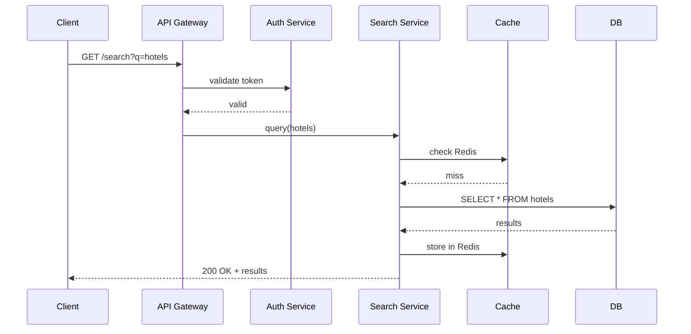

# Visual Guidelines

If you're explaining how something works internally (data structure, algorithm, system flow, neural network architecture, distributed system), you **must** include a visual.

## 1. ASCII State Tables
Use these for step-by-step algorithm traces showing how values change across an array or loop context.

```text
Binary Search for target=7 in [1, 3, 5, 7, 9, 11]

Step | low | high | mid | arr[mid] | Action
-----|-----|------|-----|----------|--------
  1  |  0  |  5   |  2  |    5     | 5 < 7 → move low to 3
  2  |  3  |  5   |  4  |    9     | 9 > 7 → move high to 3
  3  |  3  |  3   |  3  |    7     | Found! Return 3
```

## 2. ASCII Art
Use these for memory layouts, tree structures, linked lists, stack/heap visuals, tensor shapes, and network layer diagrams.

```text
HashMap after put("cat",1), put("dog",2), put("act",3):

buckets[]:
  [0] → null
  [1] → null
  [3] → Node(dog, 2) → null
  [5] → Node(act, 3) → Node(cat, 1) → null   ← collision! chained
```

## 3. Mermaid Diagrams
Use these for system flows, sequences, architecture, and network topography.


